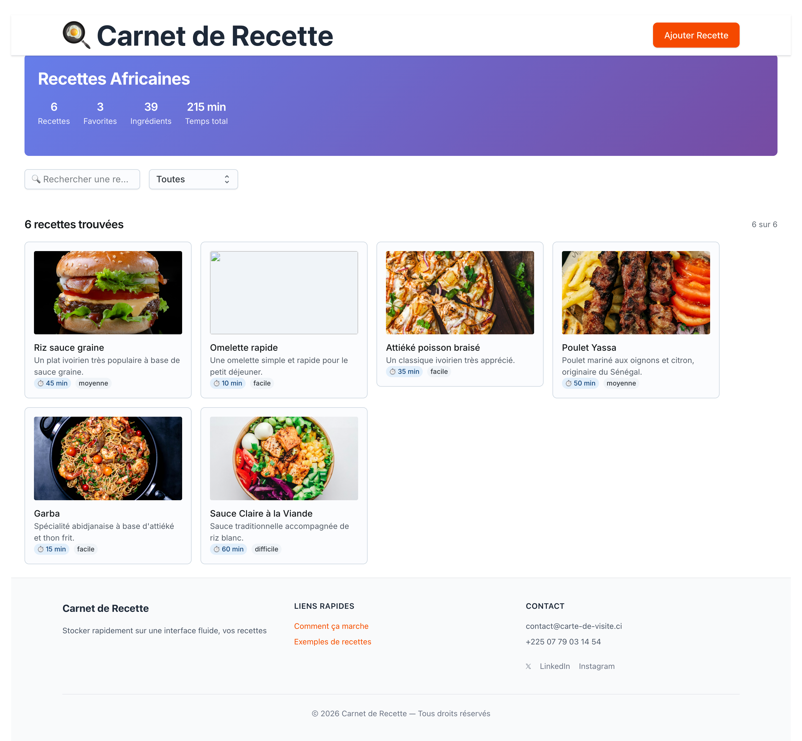

# 🍽️ Application Web de Recettes de Cuisine

## 🖼️ Aperçu de l’application



---
## 📋 Description

Projet 06 de la série **100 projets en 1 an**
Cette application web permet de **consulter, rechercher et filtrer des recettes de cuisine** de manière simple et intuitive.
Elle est conçue pour offrir une expérience fluide aussi bien sur mobile que sur desktop.

---

## ✨ Fonctionnalités

* 📖 Affichage d’une liste de recettes
* 🔍 Recherche de recettes par nom
* 🎚️ Filtrage par niveau de difficulté (facile, moyenne, difficile)
* 🧾 Données structurées (ingrédients, étapes, durée)
* 🖼️ Image de recette (optionnelle)
* 📱 Design responsive (mobile + desktop)
* 🧠 Composants React modulaires
* 🎨 Interface moderne avec **MUI Joy**

---

## 🗂️ Structure du projet

```
recette-app/
│
├── node_modules/                     # Modules Node.js
├── public/
│   └── img.png                       #  Capture d'écran de l'application
├── src/
│   ├── components/
│   │   ├── RecetteCard.jsx           # Carte d'affichage d'une recette
│   │   ├── RecetteFilter.jsx         # Barre de recherche + filtres
│   │   ├── RecetteForm.jsx           # Formulaire d'ajout de recette
│   │   ├──  Global.jsx               # Header et Footer
│   │   └── Recettes.jsx              # Page principale (liste + filtres)
│   ├── App.jsx
│   ├── main.jsx
│   └── index.css                     # Styles globaux
├── package.json                      # Dépendances et scripts
├── package-lock.json                 # Verrouillage des versions
├── README.md                         # Documentation du projet
├── vite.config.js                    # Configuration Vite
└── .gitignore                        # Fichiers ignorés par Git
```

---

## 🛠️ Technologies utilisées

* **React** + **Vite**
* **MUI Joy UI**
* **JavaScript** (ES6+)
* **TailwindCss**

---

## 🚀 Installation et utilisation

1. **Cloner le projet** :

   ```bash
     git clone https://github.com/dagbokady/05-Carnet-de-recettes.git
   ```

2. **Installer les dépendances** :

   ```bash
   npm install
   ```

3. **Lancer l’application** :

   ```bash
   npm run dev
   ```

4. **Accéder à l’application**
   Ouvrez votre navigateur à l’URL indiquée dans le terminal
   (généralement : `http://localhost:5173`)

---

## 🔎 Utilisation des filtres

* Tapez le nom d’une recette dans la barre de recherche
* Sélectionnez un niveau de difficulté
* Les résultats se mettent à jour automatiquement

---

## 🎨 Personnalisation

### Modifier le style global

Dans `index.css` :

```css
body {
  margin: 0;
  font-family: system-ui, Avenir, Helvetica, Arial, sans-serif;
}
```

### Modifier les composants

* Les cartes → `RecetteCard.jsx`
* Les filtres → `RecetteFilter.jsx`
* Le formulaire → `RecetteForm.jsx`

---

## 🤝 Contribution

Les contributions sont les bienvenues 🙌

1. Forkez le projet

2. Créez une branche :

   ```bash
   git checkout -b nouvelle-fonctionnalite
   ```

3. Committez vos changements :

   ```bash
   git commit -m "Ajout d'une nouvelle fonctionnalité"
   ```

4. Pushez :

   ```bash
   git push origin nouvelle-fonctionnalite
   ```

5. Ouvrez une Pull Request

---

## 📄 Licence

Ce projet est libre de réutilisation et de modification à des fins éducatives ou personnelles.

---


## ✉️ Contact

Pour toute question ou suggestion :

* **Auteur** : DAGBO KADY CHRIST-PHANUEL
* **Email** : [dagbokady@gmail.com](mailto:dagbokady@gmail.com)

---

**Dernière mise à jour : 26-01-2026** ✅

---
