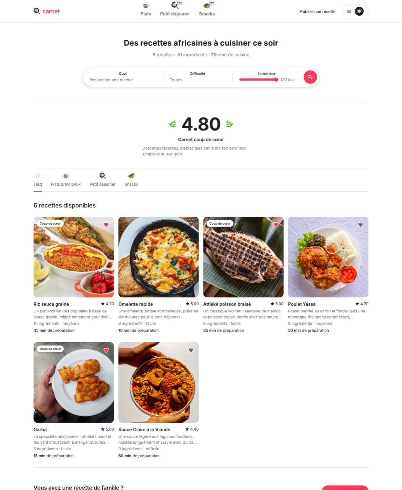
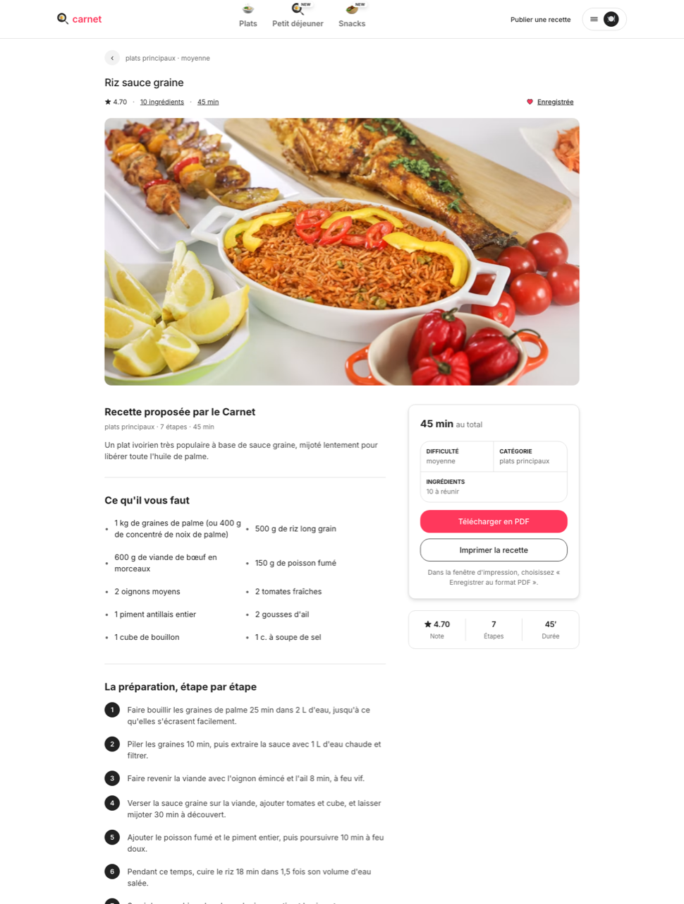

# 🍽️ Carnet de Recettes

Application web de recettes de cuisine africaines : consulter, rechercher, filtrer,
publier ses propres recettes avec photo et vidéo, et imprimer une fiche prête à emporter
en cuisine.

Projet 06 de la série **100 projets en 1 an**.

---

## 🖼️ Aperçu

### Accueil — recherche, catégories et grille de recettes



### Fiche recette — ingrédients, étapes minutées et export PDF



---

## ✨ Fonctionnalités

**Consulter**

* 📖 Grille de recettes photo-first, responsive du mobile au grand écran
* 🔍 Barre de recherche unique : mot-clé, difficulté et durée maximale
* 🗂️ Filtrage par catégorie (plats principaux, petit déjeuner, snacks)
* ❤️ Favoris, conservés d'une visite à l'autre
* 📄 Fiche détaillée : ingrédients avec quantités, étapes numérotées et minutées, vidéo

**Publier**

* 👤 Compte utilisateur (inscription / connexion), mot de passe stocké en SHA-256
* 📝 Formulaire complet : titre, description, ingrédients, étapes, durée, difficulté
* 🖼️ Upload d'une photo depuis l'appareil, redimensionnée automatiquement avant stockage
* 🎬 Upload d'une vidéo de préparation, ou lien vers une vidéo hébergée
* ✍️ Les recettes publiées sont signées par leur auteur

**Emporter en cuisine**

* 🖨️ Impression et export PDF de la fiche, avec une mise en page dédiée
  (interface masquée, une seule colonne, aucune étape coupée entre deux pages)

---

## 🎨 Design

L'interface suit un design system inspiré d'Airbnb :

* Une seule couleur d'accent, le **Rausch** `#ff385c`, réservée aux actions principales
* Texte en encre `#222222`, jamais en noir pur ; filets `#dddddd` plutôt que des ombres
* Formes douces : boutons 8px, cartes 14px, barre de recherche et pastilles en pilule
* Un seul palier d'élévation dans tout le système
* La photographie porte la hiérarchie visuelle, pas la graisse typographique

Les tokens sont déclarés dans `src/index.css` via `@theme` (Tailwind v4).

---

## 🗂️ Structure du projet

```
05-Carnet-de-recettes/
│
├── public/
│   ├── favicon.svg                   # Marmite en Rausch
│   └── screenshots/                  # Captures utilisées par ce README
├── src/
│   ├── components/
│   │   ├── Global.jsx                # Navigation et pied de page
│   │   ├── Modal.jsx                 # Modale générique + styles de champs
│   │   ├── AuthModal.jsx             # Inscription et connexion
│   │   ├── RecetteCard.jsx           # Carte d'une recette
│   │   ├── RecetteFilter.jsx         # Barre de recherche pilule
│   │   └── RecetteForm.jsx           # Publication d'une recette (photo + vidéo)
│   ├── pages/
│   │   ├── Home.jsx                  # Accueil : hero, filtres, grille
│   │   └── RecetteDetail.jsx         # Fiche détaillée d'une recette
│   ├── auth.jsx                      # Fournisseur d'authentification
│   ├── auth-context.js               # Contexte et hook useAuth
│   ├── store.js                      # Persistance locale (recettes, comptes)
│   ├── media.js                      # Compression des images importées
│   ├── utils.js                      # Calcul des notes
│   ├── data.js                       # Les six recettes de départ
│   ├── App.jsx                       # État global et routes
│   ├── main.jsx                      # Point d'entrée
│   └── index.css                     # Tokens du design system + styles d'impression
├── index.html
├── package.json
├── vite.config.js
└── README.md
```

---

## 🛠️ Technologies utilisées

* **React 19** + **Vite 7**
* **Tailwind CSS 4** (tokens déclarés en `@theme`)
* **React Router 7**
* **JavaScript** (ES6+)

---

## 🚀 Installation et utilisation

1. **Cloner le projet** :

   ```bash
   git clone https://github.com/dagbokady/05-Carnet-de-recettes.git
   ```

2. **Installer les dépendances** :

   ```bash
   npm install
   ```

3. **Lancer l'application** :

   ```bash
   npm run dev
   ```

4. **Accéder à l'application**
   Ouvrez votre navigateur à l'URL indiquée dans le terminal
   (généralement : `http://localhost:5173`)

---

## 💾 Stockage des données

Tout vit dans le navigateur, via `localStorage` : aucune donnée n'est envoyée sur un
serveur, et il n'y a rien à configurer pour démarrer.

À savoir : une vidéo importée depuis l'appareil n'existe que le temps de la session
(elle est référencée par une URL `blob:`). Pour qu'une vidéo survive au rechargement,
collez un lien vers un fichier hébergé.

Passer à un vrai service multi-utilisateurs demanderait une base de données, une
authentification côté serveur et un hébergement vidéo dédié.

---

## 🔎 Utilisation des filtres

* Tapez un mot-clé dans la barre de recherche — le titre, la description **et** les
  ingrédients sont fouillés
* Choisissez une difficulté et une durée maximale
* Cliquez une catégorie dans la bande sous le hero
* Les résultats se mettent à jour immédiatement ; « Effacer les filtres » remet tout à zéro

---

## 🎨 Personnalisation

### Changer la couleur d'accent

Dans `src/index.css`, bloc `@theme` :

```css
@theme {
  --color-rausch: #ff385c;
  --color-rausch-active: #e00b41;
}
```

### Modifier les composants

* Les cartes → `components/RecetteCard.jsx`
* La barre de recherche → `components/RecetteFilter.jsx`
* Le formulaire de publication → `components/RecetteForm.jsx`
* La fiche recette → `pages/RecetteDetail.jsx`
* La mise en page d'impression → bloc `@media print` de `src/index.css`

---

## 🤝 Contribution

Les contributions sont les bienvenues 🙌

1. Forkez le projet

2. Créez une branche :

   ```bash
   git checkout -b nouvelle-fonctionnalite
   ```

3. Committez vos changements :

   ```bash
   git commit -m "Ajout d'une nouvelle fonctionnalité"
   ```

4. Pushez :

   ```bash
   git push origin nouvelle-fonctionnalite
   ```

5. Ouvrez une Pull Request

---

## 📄 Licence

Ce projet est libre de réutilisation et de modification à des fins éducatives ou personnelles.

Les photographies des recettes proviennent d'[Unsplash](https://unsplash.com) et suivent
leur licence.

---

## ✉️ Contact

Pour toute question ou suggestion :

* **Auteur** : DAGBO KADY CHRIST-PHANUEL
* **Email** : [dagbokady@gmail.com](mailto:dagbokady@gmail.com)

---

**Dernière mise à jour : 22-08-2026** ✅
